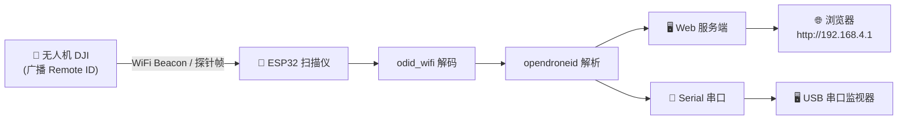

# 🛸 DroneScanner — ESP32 无人机 Remote ID 探测扫描仪

[](LICENSE)
[](https://www.espressif.com/)
[](https://www.astm.org/f3411-22a.html)

> 基于 ESP32 的无人机探测与识别系统，利用 WiFi 混杂模式监听无人机广播的 Remote ID 信号，实时解析并展示无人机信息。

---

## 📸 预览

| Web 控制面板 | 详细信息输出 |
|:---:|:---:|
|  |  |

---

## ✨ 功能特性

- **📡 无人机实时探测** — 捕获 WiFi 混杂模式下的无人机广播数据包
- **🔍 Open Drone ID 解码** — 完整解析 ASTM F3411-22a Remote ID 协议
- **🏷️ DJI 机型识别** — 内置 23 款 DJI 无人机型号库，自动匹配机型与分类
- **🖥️ Web 控制面板** — ESP32 作为 AP，手机/电脑浏览器直连查看
  - 实时列表：MAC、RSSI、型号、序列号、位置坐标
  - 实时统计：探测数量、数据包总数、运行时长
  - 一键清空列表
- **🔌 双串口输出** — Serial（USB 调试）+ Serial1（外部扩展显示屏 / 日志）

---

## 🧱 硬件要求

| 组件 | 规格 |
|------|------|
| **ESP32 开发板** | 任何带 WiFi 的 ESP32（ESP32-C3 / S3 / WROOM 等均可） |
| **USB 数据线** | 供电 + 串口调试 |
| **外接天线（可选）** | 2.4GHz 天线增强 WiFi 接收范围 |

> ✅ 无需额外射频硬件 —— 利用 ESP32 自带的 WiFi 控制器即可监听无人机广播。

### 🎥 伪造测试演示

在此感谢网友 **迷麟** 使用专业无人机侦测设备给出伪造测试结果和侦测的建议。

[](<iframe src="//player.bilibili.com/player.html?isOutside=true&aid=116746656678508&bvid=BV1ctJF6XEzL&cid=39105203321&p=1" scrolling="no" border="0" frameborder="no" framespacing="0" allowfullscreen="true"></iframe>)

> 📌 点击上图跳转 B 站观看完整演示视频。如果链接失效，请将视频上传至 B 站后替换 URL。

---

## 🚀 快速开始

### 1️⃣ 安装 Arduino IDE + ESP32 支持

1. 下载并安装 [Arduino IDE](https://www.arduino.cc/en/software)
2. 添加 ESP32 板支持：**文件 → 首选项 → 附加开发板管理器网址**
   ```
   https://raw.githubusercontent.com/espressif/arduino-esp32/gh-pages/package_esp32_index.json
   ```
3. **工具 → 开发板管理器 → 搜索 "ESP32" → 安装**

### 2️⃣ 克隆 / 下载本项目

```bash
git clone https://github.com/TechExplorer-X/DroneScanner.git
cd DroneScanner
```

或直接下载 ZIP 解压。

### 3️⃣ 编译烧录

1. 用 Arduino IDE 打开 `scanner/DroneScanner.ino`
2. 选择开发板：**ESP32 Dev Module**（或与你硬件对应的具体型号）
3. 选择正确的 COM 端口
4. 点击 **上传**（→）

### 4️⃣ 连接使用

1. 搜索 WiFi 热点：**`DroneScanner`**（密码：`12345678`）
2. 浏览器访问：[http://192.168.4.1](http://192.168.4.1)
3. Web 页面自动刷新，无人机出现即显示

---

## ⚙️ 工作原理



1. **混杂模式监听** — ESP32 开启 WiFi 混杂模式（`wifi.c`），不连接任何路由器
2. **过滤 ODID 帧** — 监听所有 2.4GHz WiFi 数据包，过滤包含 ODID 协议头的 Beacon / 探针帧
3. **协议解码** — `odid_wifi` 提取 ODID 载荷，`opendroneid` 将其解码为结构化数据
4. **数据缓存** — 解析结果存入无人机环形缓存（最多 `MAX_DRONES` = 20 条），新数据覆盖旧数据
5. **可视化** — 内嵌的 WebServer 提供 REST API 和 HTML 控制面板
6. **调试输出** — Serial 串口（115200 baud）输出实时日志，供调试或外接屏幕

---

## 🛠️ 配置说明

### WiFi 热点

在 `scanner/DroneScanner.ino` 顶部修改：

```cpp
const char* AP_SSID = "DroneScanner";     // 热点名称
const char* AP_PASSWORD = "***";          // 热点密码
const int AP_CHANNEL = 6;                 // WiFi 信道
```

### 串口引脚

```cpp
const int SERIAL1_RX_PIN = 7;
const int SERIAL1_TX_PIN = 6;
```

可根据硬件接线自由调整。

---

## 🌐 API 接口

> ESP32 作为 AP 提供以下 REST API：

| 路径 | 方法 | 说明 |
|------|:----:|------|
| `/` | GET | Web 控制面板（HTML + JS） |
| `/api/drones` | GET | 返回 JSON 格式无人机列表 |
| `/api/clear` | GET | 清空所有探测记录 |

### `/api/drones` 响应示例

```json
{
  "drones": [
    {
      "mac": "AA:BB:CC:DD:EE:FF",
      "rssi": -65,
      "uav_id": "1581F8LQ1234",
      "model_name": "Mavic 4 Pro",
      "category": "消费级",
      "lat": 39.9042,
      "lon": 116.4074,
      "altitude_msl": 120,
      "height_agl": 80,
      "speed": 5.2,
      "heading": 180,
      "op_id": "OPERATOR_ID",
      "last_seen": 3
    }
  ],
  "count": 1,
  "packets": 42
}
```

返回字段说明：

| 字段 | 类型 | 说明 |
|------|:----:|------|
| `mac` | string | 无人机 MAC 地址 |
| `rssi` | int | 信号强度（dBm） |
| `uav_id` | string | 无人机序列号 |
| `model_name` | string | 匹配到的 DJI 机型名称 |
| `category` | string | 分类：消费级 / 穿越机 / 行业级 |
| `lat`, `lon` | float | 无人机经纬度 |
| `altitude_msl` | float | 海拔高度（m） |
| `height_agl` | float | 相对地面高度（m） |
| `speed` | float | 水平速度（m/s） |
| `heading` | float | 航向角（°） |
| `op_id` | string | 操作员 ID |

---

## 🗂️ 项目结构

```
DroneScanner\
├── README.md               # 本文件（GitHub 项目说明）
├── LICENSE                 # MIT 许可证
├── scanner/
│   ├── DroneScanner.ino    # 主程序（Web UI + API + 核心逻辑）
│   ├── opendroneid.h       # Open Drone ID 协议解码头文件
│   ├── opendroneid.c       # Open Drone ID 协议解码实现
│   ├── odid_wifi.h         # ODID over WiFi 封装（含 extern "C" 保护）
│   └── wifi.c              # WiFi 混杂模式配置
└── docs/
    └── images/             # 截图存放目录
```

---

## 📊 DJI 机型库

内置 **23 款** DJI 无人机的 prefix → 型号 → 分类映射表：

| 分类 | 机型数量 | 举例 |
|:----:|:--------:|------|
| **消费级** | 12 | Mavic 4 Pro, Mavic 3 Pro, Air 3S, Air 3, Mini 5 Pro, Mini 4 Pro 等 |
| **穿越机** | 7 | Avata 3, Avata 2, Neo 2, DJI FPV, Flip 等 |
| **行业级** | 4 | Matrice 350, Matrice 30, Mavic 3E, Mavic 3T, Inspire 3 等 |

> 机型匹配基于前缀（`1581F8` 等硬件标识符），可在 `DroneScanner.ino` 的 `DJI_机型` 数组中扩展。

---

## 🔬 调试输出示例

USB 串口（115200 baud）输出实时日志：

```
================================
=== 无人机探测 v2.0 ===
================================
Starting AP...
AP: DroneScanner
Web: http://192.168.4.1
Init RF...
Web server ready

正在扫描周围的无人机信号...

[42] AA:BB:CC:DD:EE:FF RSSI:-60 | 机型:Mavic 4 Pro | 39.9042,116.4074 alt:120m
[state] 3 targets | 187 packets
```

---

## ❓ 常见问题

<details>
<summary><b>连接不到 WiFi 热点？</b></summary>

确认 ESP32 已上电，在手机/电脑 WiFi 列表中搜索 `DroneScanner`。如 ESP32 已正常启动但找不到热点，检查天线是否连接。
</details>

<details>
<summary><b>探测不到无人机？</b></summary>

- 确保无人机已起飞（部分机型在地面不广播 Remote ID）
- 靠近无人机试试，不带天线测试 100m 左右可侦测到
- 检查 ESP32 天线是否接好
- 用串口监视器查看实时日志，确认 ESP32 是否正常接收数据包
</details>

<details>
<summary><b>Web 页面一直显示 0 无人机？</b></summary>

打开 Arduino IDE 串口监视器（115200 baud），查看是否有 `[state]` 日志输出。如果完全无输出，检查 WiFi 混杂模式是否初始化成功。
</details>

---

## 📄 License

本项目基于基于开源 ODID 库和 ESP32 Arduino 框架开发，**仅用于教育和研究目的**。

- [Open Drone ID](https://github.com/opendroneid) — 开源 ODID 协议实现
- [ASTM F3411-22a](https://www.astm.org/f3411-22a.html) — Remote ID 标准
- [ESP32 Arduino WiFi](https://docs.espressif.com/projects/arduino-esp32/en/latest/api/wifi.html) — 官方文档

---

## 🙌 贡献

欢迎 Issue 和 PR！如果添加了新的 DJI 机型映射或改进了 ODID 解码，请附上对应的硬件标识符和测试数据。
